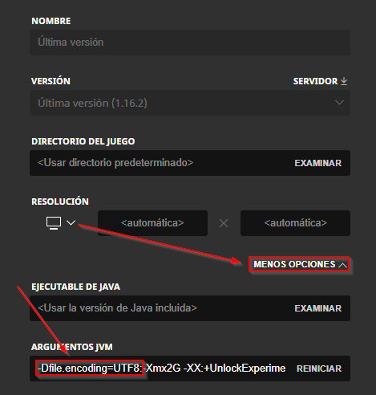

# minecraftTranslator

set your "latest.log" path in the log variable

Windows users: Consider adding `-Dfile.encoding=UTF8` to your Java arguments if you have log files with questions marks in them

